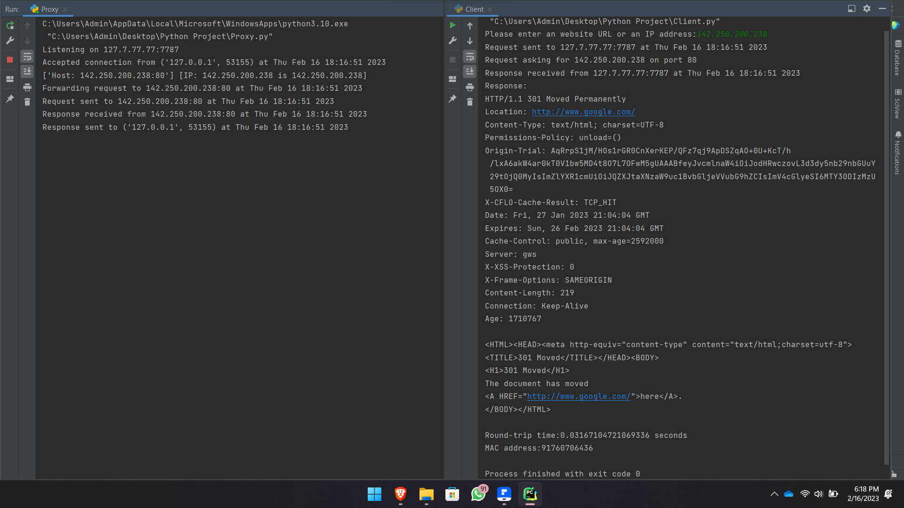

# Server-Client
  
  
## Client Code
The client code allows a user to enter a website URL or IP address and port to send an HTTP GET request through a proxy server.

It does the following:

- Gets input from the user for the website URL/IP and sets the default port to 80.
- Creates a socket and connects it to the proxy server at 127.7.77.77 on port 7787.
- Constructs an HTTP GET request with the Host header set to the user-provided URL/IP and port.
- Records the start time before sending the request.
- Sends the request to the proxy server.
- Prints the start time and request details.
- Receives the response from the proxy server.
- Records the end time after receiving the response.
- Prints the end time.
- Prints the response.
- Calculates and prints the total round trip time.
- Gets and prints the MAC address of the client.

## Proxy Server Code
The proxy server acts as an intermediary between the client and destination servers.

It does the following:

- Binds a TCP socket to listen on 127.7.77.77 on port 7787.
- Accepts incoming connections from clients.
- Receives the HTTP request from the client.
- Validates the request, checking for, Empty request and/or Missing Host header.
- Parses the Host header to get the destination IP and port.
- Resolves the domain name to an IP address if a URL is provided.
- Prints the request details.
- Opens a connection to the destination IP and port.
- Sets a timeout of 10 seconds in case the destination is unreachable.
- Handles errors for timeout and connection failures.
- Forwards the client's request to the destination server.
- Receives the response from the destination server.
- Handles error for empty response.
- Sends the response back to the client.
- Closes connections to the client and destination server.
